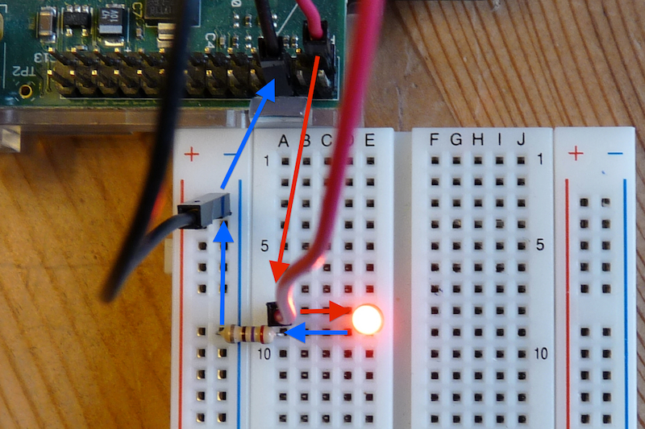

This repo is a demo of controlling an LED with Raspberry Pi's GPIO, based on Jonathan Perkin's article ["A node.js-powered 8-bit CPU"](http://www.perkin.org.uk/posts/a-nodejs-powered-8-bit-cpu-part-one.html).



## Devices

Following devices are needed.

- A Raspberry Pi
- A BreadBoard
- Some LEDs
- Some jumper wire
- Some 270 Ohm (Ω) resistors

## Prerequisites

(1) A jumper wire going from pin 11 on the Raspberry Pi (GPIO 17) to a socket on the positive line of the breadboard.


(2) A jumper wire going from pin 6 on the Raspberry Pi (ground) to a socket on negative line of the breadboard.

(3) An LED vertically, with the anode (positive) above and the cathode (negative) below. To determine the correct orientation the bottom side is usually flat, and/or the anode is longer.

(4) A 270Ω resistor connecting the breadboard's negative line to the LED's cathode line. The resistor is required to reduce the voltage from 3.3V down to the 2.0V or so that the LED needs - without it the LED will likely burn brightly for a short time before blowing.

(5) Add the current user into `GPIO` group.

```bash
$ sudo adduser pi gpio
```

In the above line, `pi` is the default user of Raspberry Pi.

## Install

Now, clone the repo and install the dependencies.

```bash
$ git clone https://github.com/ruanyf/rpio-led-demo.git
$ cd rpio-led-demo
$ npm install
```

## Usage

Turn the LED on.

```bash
$ node led-on.js
```

Turn the LED off.

```bash
$ node led-off.js
```

Make the LED blinking.

```bash
$ node led-blink.js
```

Launch a server on port 8080.

```bash
$ node server.js
```

Open another terminal, and visit the port.

```bash
$ curl http://localhost:8080
```

When receiving a request, the server will send a signal to make the LED giving a blink.
